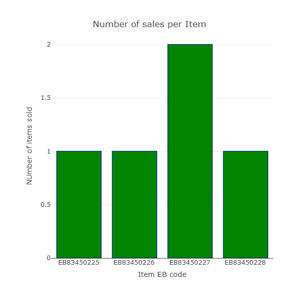

## Mock Financial Report

### Starting Data

|item_id    |cust_id   |sale_type  |
|:----------|:---------|:----------|
|EB83450225 |C97262751 |cash       |
|EB83450226 |C97262752 |visa       |
|EB83450227 |C97262753 |visa       |
|EB83450228 |C97262755 |mastercard |
|EB83450227 |C97262751 |visa       |

|cust_id   |name                 |      phone|address          |
|:---------|:--------------------|----------:|:----------------|
|C97262751 |Ryan Graue4259854941 | 4259844941|5004 17th ave NE |
|C97262752 |Frank                | 2061234567|1234 N 56st      |
|C97262753 |Paul                 | 1234567890|3500 stone way N |
|C97262755 |Pete                 | 4250001679|45 deerborn ln   |

|item_id    |name            |  price|
|:----------|:---------------|------:|
|EB83450225 |marker griffon  | 249.99|
|EB83450226 |evo t-shirt     |  19.99|
|EB83450227 |socks           |  12.99|
|EB83450228 |hydroflask 25oz |  34.99|

The data started out in three seperate data tables hosted by mongoDB. It was then brought into R using the mongoLite package, and turned into r dataframes, to begin the data analysis. Bare in mind that this is completely made up data. Meeaning that it in real world applications there would be tens of thousands of onjects with many more fields, allowing for much more complex analysis and solutions.

## Analysis

For this example we can look at very basic analysis for this infomration on sales. Such as the total number of sales, being 5. With 4 customers contributing a total of $330.95.

We can then dive deeper into the data. For example a table bar chart of number of sales per item.

